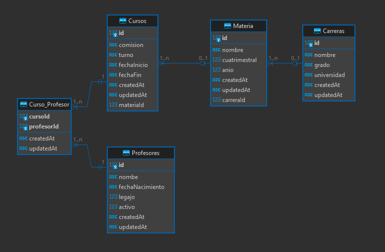

# Estrategias de Persistencia - TP 2024



### Descripción del modelo DER
- Una **Carrera** puede tener muchas materias.
- Una **Materia** puede se puede dictar en muchos cursos.
- Un **Curso** puede ser dictado por muchos profesores.
- Un **Profesor** puede dictar muchos cursos.

### Base de datos
El motor de base de datos a utilizar podra ser elegido por los alumnos. La recomendacion es utilizar sqlite para pruebas simple y luego probar con otro motor de base de datos tipo MySql o Postgres.

### Intalacion de dependencias
```npm i sequelize sqlite3```
```npm i -D sequelize-cli``` 
```npm i joi``` 

- Inicializar un proyecto sequelize

```npx sequelize-cli init```

- Correr proyecto
  
```npm run dev```

## API
Implementar la API utilizando el framework express en el entorde de ejecucion de un poryecto NodeJs. Organizar el código en rutas, controlers y middleware utilizando la separación por recurso. A continuación se detallan los endpoinds que deberán estar disponbiles en la API.

|Verbo|Recurso|Status code|Descripción|
|-----|-------|-----------|-----------|
|Get|/carreras|200|Obtener todas la carreras|
|Get|/carreras/:id|200, 404|Obtener una carrera en particular|
|Post|/carreras|201 , 400|Crear una Carrera|
|Post|/carreras/:id/materia|201, 404, 400|Crea un materia dentro de una carrera|
|Get|/carreras/:id/materias|200, 404| Obtener todas la materias de una Carrera
|Get|/materias|200|Obtener todas las materias|
|Get|/materias/:id|200, 404|Obtener una materia en particular|
|Delete|/materias/:id|200, 404, 500|Borra una materia en particular|
|Post|/materias/:id/curso|201, 404, 400|Crea un Curso para la la Materia|
|Get|/materias/:id/cursos|200, 404| Obtener los Curso de la Materia
|Get|/cursos|200|Obtener todos los cursos|
|Get|/cursos/:id|200, 404|Obtener un curso en particular|
|Delete|/cursos/:id|200, 404, 500|Borra un curso en particular|
|Put|/cursos/:id|200, 404|Modificar los datos de un curso particular
|Get|/profesores|200|Obtener todos los profesores
|Get|/profesores/:id|200, 404|Obtener un profesor en particular
|Post|/profesores|201, 400|Crear un profesor
|Put|/profesores/:id|200, 404|Modificar lo datos de un profesor
|Delete|/profesores/:id|200, 404, 500|Borrar un profesor
|Post|/cursos/:id/profesores|201, 404, 400|Crea la asociacion curso con 1 o N profesores
|Get|/cursos/:id/profesores|202, 404|Obtener todos los profesores de un Curso
|Get|/profesores/:id/cursos|200, 400|Obtener todos los curso que tiene un profesro


